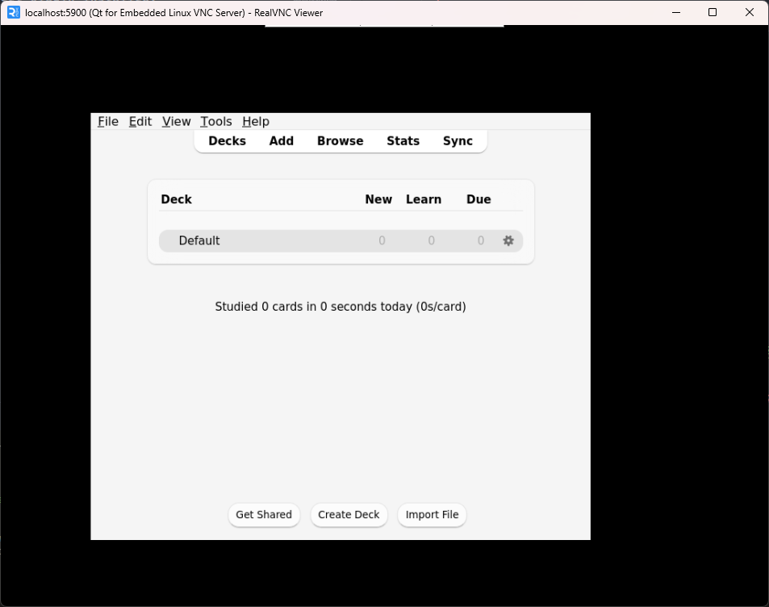

# Headless Anki
Headless Anki with a VNC GUI endpoint.

The default user profile is as barebones as it can get.

The following volumes are exposed and can be mounted by the user:
- `/data`: Anki data (Profile, decks etc.).
- `/export`: Optional path for exports/backups.

## Usage
To run, execute:
```bash
docker run -d -p 8080:8080 -v $(pwd)/export:/export thisisnttheway/headless-anki:latest
```

To bring your own Anki profile, mount it on `/data` in the container:
```bash
docker run -d -v ~/.local/share/Anki2:/data thisisnttheway/headless-anki:latest
```

You can also use other QT platform plugins by setting the env var `QT_QPA_PLATFORM`:
```bash
docker run -e QT_QPA_PLATFORM="offscreen" ...
```

By default, Anki is launched with `QT_QPA_PLATFORM="vnc"`.  
The startup script then exposes this VNC session through noVNC/websockify on port `8080` (or `$PORT` in Cloud Run). Open `https://<service-url>/vnc.html` to connect.  


## Building
To quickly build the image yourself, issue:
```bash
docker build --progress=plain . -t headless-anki:custom
```

Different versions of Anki and QT can be installed. Supply those versions as build flags:
```bash
docker build \
    --build-arg ANKI_VERSION=25.02.4 \
    --build-arg QT_VERSION=6 \
    -t headless-anki:custom \
    .
```

For available versions, refer to:
- [Anki GitHub releases](https://github.com/ankitects/anki/releases)
